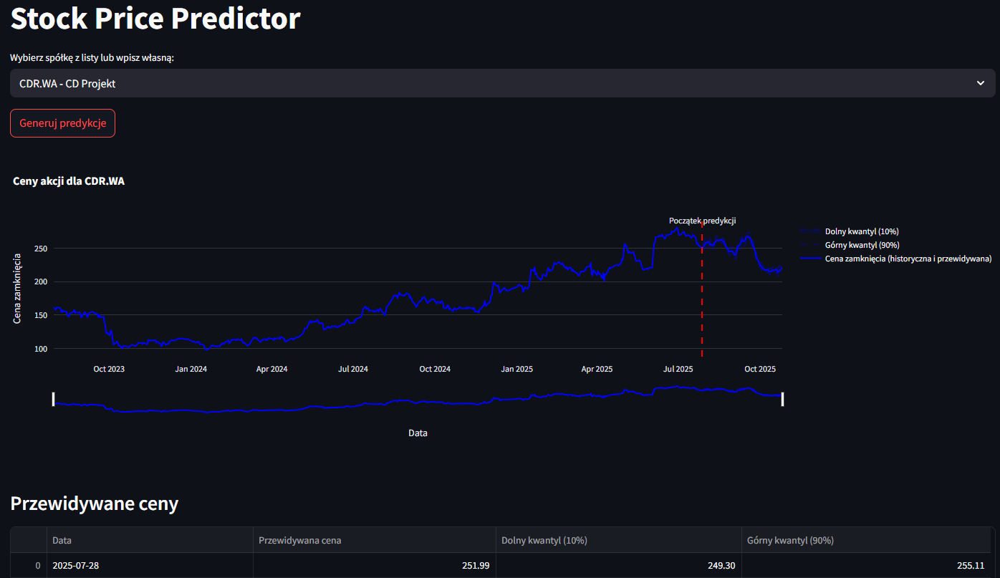
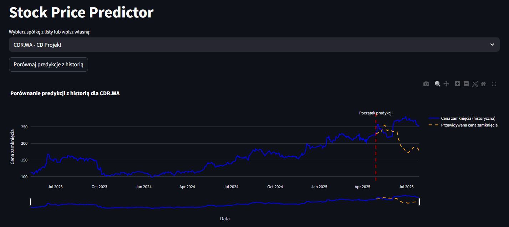
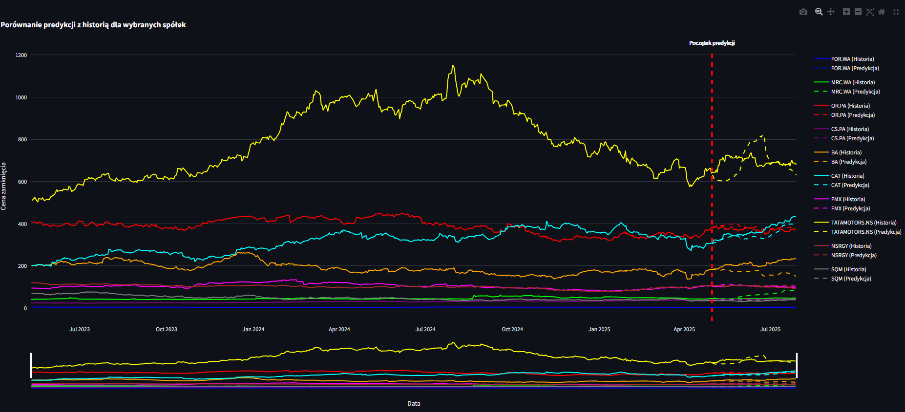
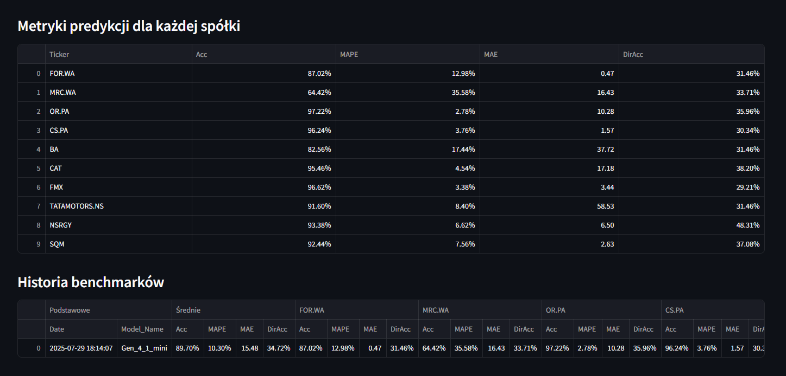

# 📈 Model Predykcyjny Kursu Akcji

Ten projekt implementuje model predykcyjny kursu akcji oparty na danych giełdowych, wykorzystujący Temporal Fusion Transformer (TFT). Zawiera również aplikację webową zbudowaną w Streamlit, która umożliwia wizualizację prognoz, porównanie predykcji z danymi historycznymi oraz ocenę skuteczności modelu poprzez benchmark.

---

## 🚀 Funkcjonalności

- **Trening modelu**: Skrypt `start_training.py` pozwala na pobranie danych giełdowych, trening modelu i zapis wyników.
- **Predykcje przyszłości**: Aplikacja Streamlit generuje prognozy cen akcji dla wybranych tickerów (np. `CDR.WA`).
- **Porównanie z historią**: Możliwość porównania predykcji z rzeczywistymi danymi historycznymi.
- **Benchmark**: Ocena skuteczności modelu na zestawie tickerów z metrykami takimi jak Dokładność i Dokładność kierunkowa.

---

## 🖥️ Uruchomienie projektu

### Trening modelu
Aby rozpocząć trening modelu, uruchom:
```bash
python start_training.py
```
Skrypt pobiera dane giełdowe (za pomocą `yfinance`), trenuje model TFT i zapisuje wyniki w folderze `models`.

### Aplikacja webowa
Aby uruchomić aplikację Streamlit:
```bash
streamlit run app/app.py
```
Aplikacja umożliwia:
- Generowanie predykcji dla wybranego tickera.
- Porównanie predykcji z danymi historycznymi.
- Wyświetlenie wyników benchmarku dla zestawu tickerów.

---

## 📊 Przykłady wyników

### Predykcje dla `CDR.WA`
Poniżej przedstawiono przykład predykcji cen zamknięcia dla tickera `CDR.WA` na kolejne dni, z kwantylami 10% i 90%.



### Porównanie predykcji z historią dla `CDR.WA`
Wykres porównuje przewidywane ceny zamknięcia z rzeczywistymi danymi historycznymi dla `CDR.WA`.



### Benchmark
#### Wykres benchmarku
Wykres porównuje predykcje z danymi historycznymi dla tickerów zdefiniowanych w pliku `config/benchmark_tickers.yaml` (unikalne tickery, różne od tych użytych w treningu).



#### Tabela metryk benchmarku
Tabela przedstawia metryki skuteczności modelu dla tickerów w benchmarku, takie jak Accuracy, MAPE, MAE i Directional Accuracy.



---

## ⚠️ Ograniczenia danych

Biblioteka `yfinance` używana do pobierania danych giełdowych nie dostarcza **historycznych** wartości wskaźników fundamentalnych, takich jak:
- **PE ratio** (Price to Earnings)
- **PB ratio** (Price to Book)

Dostępne są jedynie **aktualne wartości** tych wskaźników poprzez metodę `Ticker().info`.

---

## 📁 Struktura projektu

```
├── app/
│   ├── app.py                 # Streamlit app — UI do wyboru tickerów, wyświetlania predykcji i benchmarku
│   ├── benchmark_utils.py     # Funkcje do wykonywania benchmarku i obliczania metryk
│   ├── config_loader.py       # Ładowanie konfiguracji aplikacji i list tickerów
│   └── plot_utils.py          # Funkcje generujące wykresy i wizualizacje
├── scripts/
│   ├── config_manager.py      # Zarządzanie konfiguracją, zapisywanie/odczyt normalizerów i modeli
│   ├── data_fetcher.py        # Pobieranie danych giełdowych (yfinance), zapis surowych plików
│   ├── model.py               # Definicja architektury modelu (TFT) i utilities do tworzenia modelu
│   ├── prediction_engine.py   # Logika generowania predykcji przy użyciu wytrenowanego modelu
│   ├── preprocessor.py        # DataPreprocessor — przygotowanie cech, normalizacja, budowa TimeSeriesDataSet
│   ├── train.py               # Skrypt treningowy — uczenie modelu, checkpointing, logowanie metryk
│   ├── utils/
│   │   ├── feature_engineer.py        # Funkcje tworzące cechy techniczne i czasowe (MA, RSI, itd)
│   │   ├── model_config.py            # Helpery do walidacji i budowy konfiguracji modelu
│   │   ├── transfer_weights.py        # Narzędzia do przenoszenia wag między checkpointami
│   │   └── validation_utils.py        # Metryki i funkcje walidacyjne 
│   └── debug/
│       ├── debug_dataset.py    # Skrypty pomocnicze do debugowania TimeSeriesDataSet i danych
│       ├── feature_importance.py # Eksperymenty / skrypty analizy ważności cech
│       └── transfer_weights.py  # Narzędzia do przenoszenia wag między modelami
├── config/
│   ├── config.yaml            # Główne ustawienia projektu (ścieżki, parametry modelu)
│   ├── tickers.yaml           # Lista tickerów
│   └── benchmark_tickers.yaml # Lista tickerów używanych w benchmarku (inne niż w treningu)
├── data/                   # Dane surowe i przetworzone
├── models/                 # Zapisane modele oraz normalizery
├── docs/                   # Materiały pomocnicze (obrazy, wykresy do README)
├── start_training.py       # Wygodny wrapper uruchamiający pełny pipeline treningowy
├── README.md               # Dokumentacja projektu
└── requirements.txt        # Lista zależności
```

---

## 🛠️ Wymagania

Projekt wymaga Pythona 3.9+ oraz zależności wymienionych w pliku `requirements.txt`. Aby zainstalować zależności, wykonaj:
```bash
pip install -r requirements.txt
```

> **Uwaga**: Pełna lista bibliotek (np. `streamlit`, `yfinance`, `pytorch`, `pandas`) znajduje się w `requirements.txt`. Upewnij się, że środowisko wirtualne jest aktywne przed instalacją.

---

## 📚 Modele

Porównanie modeli:

| Model       | Opis                              | Dokładność | Długość predykcji | Szybkość treningu          | Total Params |
|-------------|-----------------------------------|------------|-------------------|----------------------------|--------------|
| gen3        | Pierwszy użyteczny model          | 88.9%      | 90 dni            | 60 min/epoka, 30 próbek/s  | -            |
| gen3mini    | Lżejsza wersja do szybkich testów | 87.8%      | 90 dni            | 20 min/epoka, 90 próbek/s  | 2.7M         |
| gen4mini    | Zmniejszona liczba cech           | 88.0%      | 90 dni            | 20 min/epoka, 90 próbek/s  | 2.7M         |
| gen6        | Wersja z małą liczbą parametrów   |  -         | 60 dni            | 10 min/epoka, 192 próbek/s | 1.7M         |
| gen6_1      | Wersja gdzie model nie oczekuje parametrów z przyszłości, zbliżone do rzeczywistych warunków. Wymaga długiego treningu   |  92%         | 60 dni            | 6 min/epoka, 300 próbek/s | 1.4M         |


> **Uwaga**: Wartość `Szybkość treningu` jest względna i będzie się różnić w zależności od posiadanego sprzętu (CPU/GPU, ilości pamięci, sterowników i konfiguracji). Rzeczywiste czasy mogą się od niej różnić.